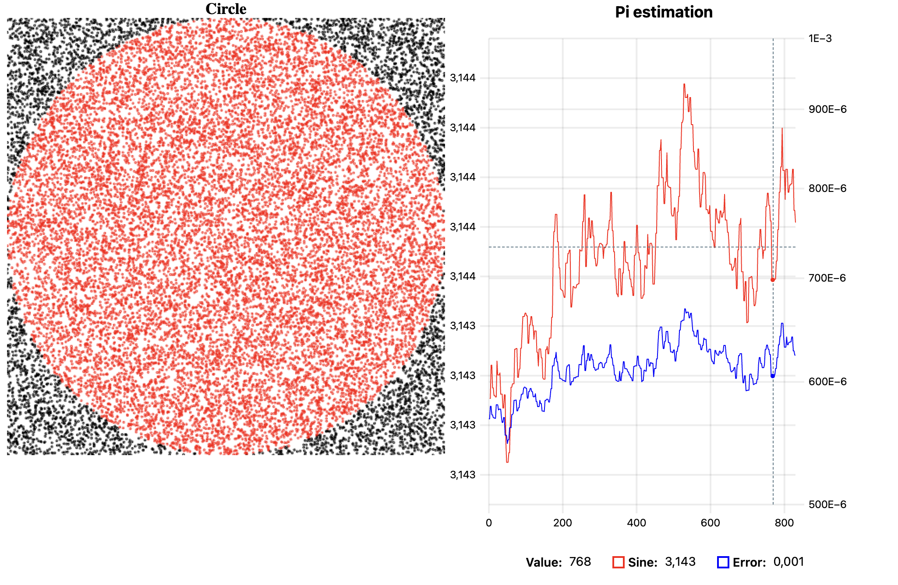

# Estimate Pi with Kafka

Start Kafka locally first:

```
docker run -it --rm -p 9092:9092 apache/kafka:3.7.0
```

Then start the app with

```
mvn exec:java
```

Open browser in `localhost:8081`.


